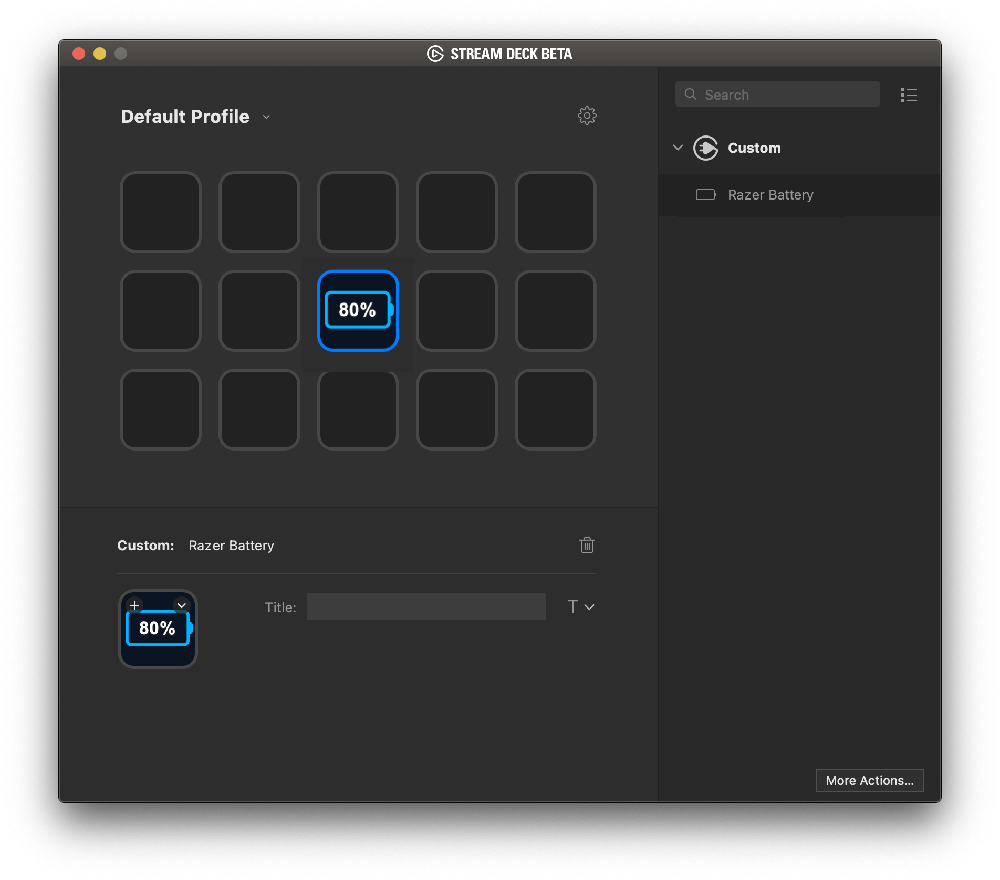

# macOS Razer Battery Plugin for Stream Deck 

This is a simple Stream Deck plugin that displays the battery status of a Razer mouse device on macOS.

The plugin is based on the [CPU Plugin from Elgato](https://github.com/elgatosf/streamdeck-cpu), and uses [librazermacos](https://github.com/alexjsp/librazermacos) to read the battery status from the mouse.

## Installation

You can download the latest release from the releases section on the right, and double click the `streamDeckPlugin` to install it.

## Compiling, Source, and Contributing

The Sources folder contains the source code of the plugin. I'll write up some compilation instructions at some point. If you want to contribute feel free to throw a PR up.
